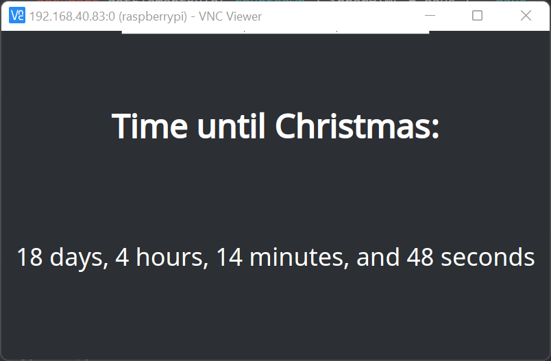

# christmas-countdown
Simple countdown for the holidays

## Usage
1) Clone this repository
2) Open `countdown.html`
3) Enjoy the holidays and anticipate the birth of Christ (and free things).

Designed for smaller screens, like those for the Raspberry Pi.

## Extras
In the `extras` folder, you will find a script for setting display properties and launching the browser. You may configure it to launch upon system startup if you'd like.

## Screenshots

